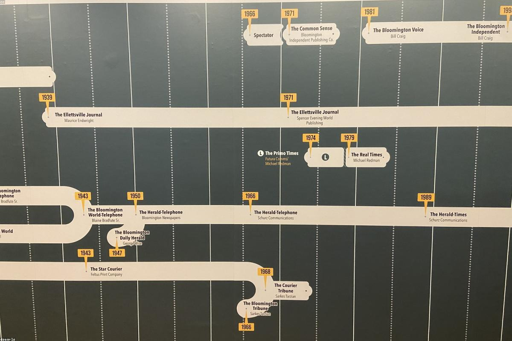
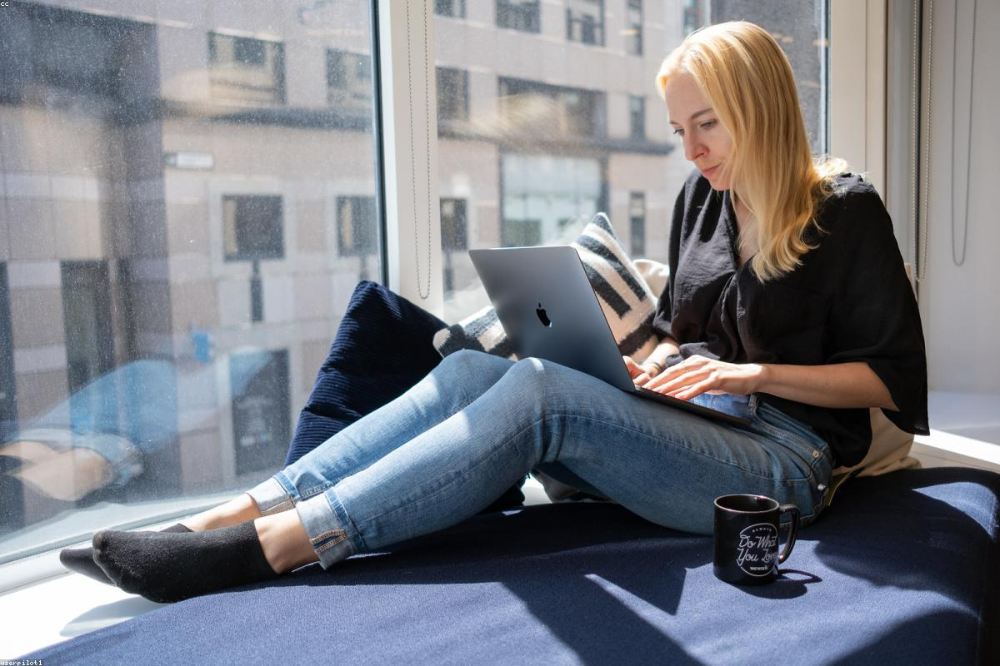
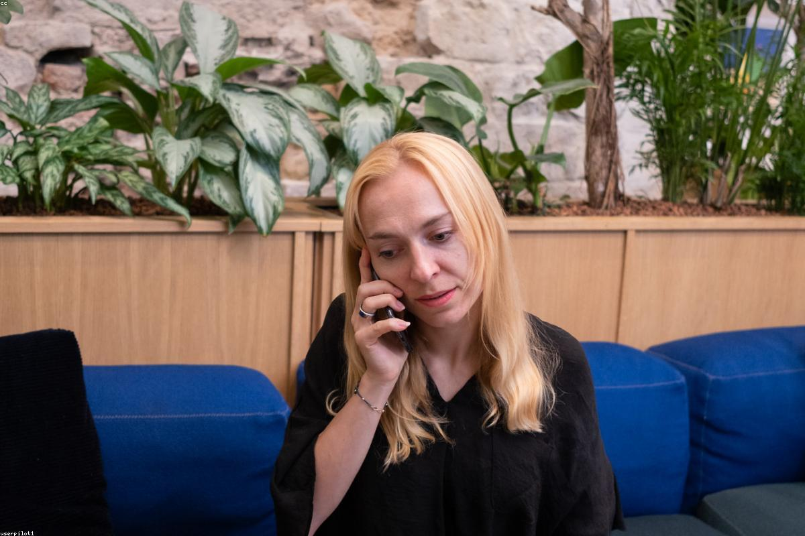
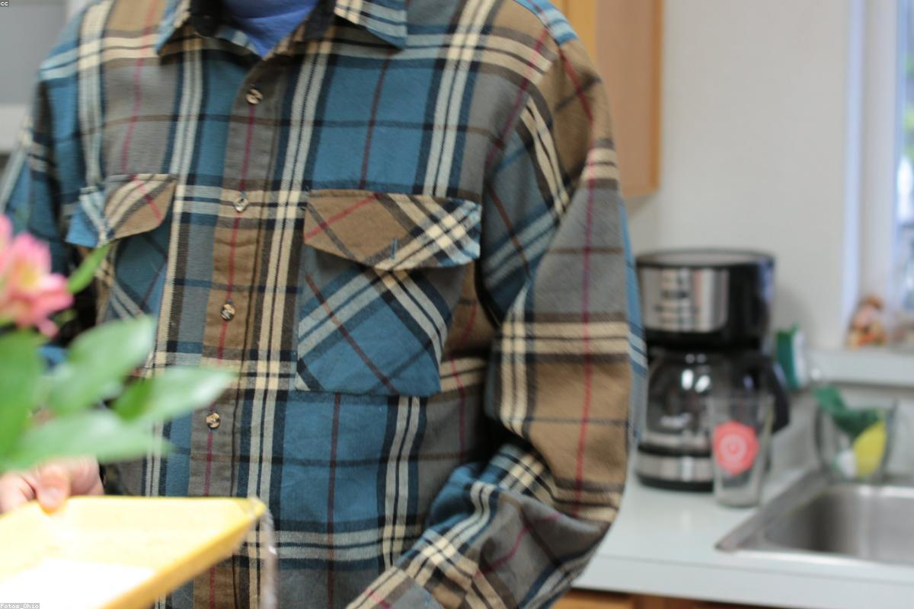

# Contenuti del sito personale — TEMPLATE DI ESEMPIO

> **Nota d'uso**: questo file contiene tutto il testo necessario per il sito personale di un ipotetico studente del 5° anno dell'IIS Marconi Pieralisi di Jesi, indirizzo Informatica e Telecomunicazioni. I dati sono **inventati**: ogni studente deve sostituirli con i propri (nome, foto, esperienze, progetti, premi, ecc.) mantenendo la stessa struttura. I segnaposto del tipo `[DA PERSONALIZZARE]` indicano i punti in cui inserire le proprie informazioni reali.

---

## 0. DATI ANAGRAFICI E IDENTITÀ

- **Nome e Cognome**: Michele Bartoloni
- **Età**: 18 anni
- **Residenza**: Ostra (AN)
- **Scuola**: IIS "Marconi Pieralisi" di Jesi
- **Indirizzo**: Informatica e Telecomunicazioni — articolazione Informatica
- **Classe**: 5ª CM — Anno scolastico 2025/2026
- **Email**: michelebartoloni3@gmail.com
- **Instagram**: @michele.bartoloni
- **GitHub**: https://github.com/st10769

---

> **Nota importante per la pagina Home**: le sezioni 1, 2 e 3 vivono **sulla stessa pagina (`index.html`)** in scorrimento verticale. Sono state scritte come un unico racconto che si sviluppa naturalmente: prima un saluto breve, poi la presentazione personale e di studi, poi le passioni. Evita quindi qualsiasi "anticipo" tra una sezione e l'altra: ogni argomento viene introdotto una sola volta, nel momento in cui viene approfondito.

## 1. HOME — Hero di apertura

### Titolo della pagina
Michele Bartoloni

### Sottotitolo
Studente di Informatica — IIS "Marconi Pieralisi", Jesi

### Pulsanti CTA dell'hero
- "Scopri di più" → ancora alla sezione "Chi sono" (`#chi-sono`)
- "Le mie materie" → link a `materie.html`

---

## 2. CHI SONO

### Presentazione (paragrafo principale)
Mi chiamo Michele, ho 18 anni e vengo da un paesino dove tutti si conoscono. Non sono il tipo che si entusiasma per tutto — la maggior parte delle cose le guardo passare senza troppo interesse. Ma quando trovo qualcosa che mi accende, cambia tutto: ci penso, ci torno sopra, ci metto tempo e fatica senza che nessuno me lo chieda. È il mio modo di funzionare, e ormai ho smesso di scusarmene.

### Il mio percorso di studi
Ho scelto il Marconi Pieralisi di Jesi perché volevo una scuola che non si fermasse alla teoria. Nel triennio ho studiato programmazione, basi di dati, reti e progettazione software e nonostante le difficoltà sono comunque riuscito a trarne qualcosa di positivo. Dopo il diploma, l'idea è quella di entrare nel mondo del lavoro e mettere in pratica quello che ho imparato.

### Uno sguardo al futuro
So che c'è ancora tanto da imparare — e per una volta non mi spaventa. Voglio lavorare in un posto dove le cose si costruiscono davvero, dove la tecnologia non è solo uno strumento ma il punto di partenza. E magari farlo da qualche posto in montagna, perché alla fine il posto in cui vivi conta quanto il lavoro che fai

### Immagini suggerite
- `immagini/profilo.jpg` — foto profilo dello studente (sostituibile)
- `immagini/scuola-marconi.jpg` — istituto Marconi Pieralisi

---

## 3. PASSIONI

### Frase di passaggio (1 riga, fa da ponte con la sezione precedente)
La scuola occupa una parte importante delle mie giornate, ma non è tutto. Ci sono quattro cose che, fuori dall'aula, mi raccontano meglio di qualsiasi voto: il calcio, la musica e stare con gli amici.

### 3.1 Musica
Ho le cuffie nelle orecchie più o meno sempre, da quando ricordo. Ascolto rap, trap e reggaeton — roba che o ami o odi, ma a me mette a posto la testa. La musica mi accompagna in qualsiasi momento, ma è quando voglio davvero staccare che la sento di più. Tra tutti, quello che metto su più spesso è Shiva.

### 3.2 Sport — Calcio
Gioco a calcio da quando avevo 8 anni, sempre nella squadra del mio paese, che ora milita in promozione. È uno di quei pezzi della mia vita che è rimasto costante mentre tutto il resto cambiava. Mi ha insegnato più cose di quanto mi aspettassi: lavorare con gli altri, perdere senza farne un dramma, presentarsi agli allenamenti anche quando non ne hai voglia. Alla fine, molto di quello che so su come funziona un gruppo l'ho imparato su un campo di calcio.

### 3.3
Gli amici del paese li ho da sempre — alcuni li conosco da prima delle elementari. Non ci vediamo tutti i giorni come una volta, ma quando ci siamo è come se il tempo non fosse passato. Sono il tipo di amicizie che non hai bisogno di coltivare ogni momento per sapere che ci sono.

### Immagini suggerite per le passioni
- `immagini/passione-musica.jpg`
- `immagini/passione-calcio.jpg`
- `immagini/passione-tecnologia.jpg`
- `immagini/passione-viaggi.jpg`

---

## 4. MATERIE SCOLASTICHE

Le materie del quinto anno al Marconi Pieralisi si dividono tra area tecnica e area umanistica. Per ognuna: una descrizione rapida e gli argomenti principali che abbiamo affrontato durante l'anno.
### AREA SCIENTIFICA / TECNICA

#### 4.1 Informatica
L’Informatica rappresenta il cuore del nostro percorso di studi. Durante il quinto anno abbiamo approfondito lo sviluppo web full-stack e la progettazione di basi di dati relazionali, applicando le conoscenze acquisite nella realizzazione di un progetto concreto: Scout Admin. Il lavoro è stato svolto in collaborazione con il professore e organizzato come in un vero team di sviluppo, utilizzando Git per la gestione del codice e suddividendo le attività tra frontend e backend. Questa esperienza ci ha permesso di confrontarci con dinamiche molto vicine a quelle del mondo professionale.

#### 4.2 Sistemi e Reti
Sistemi e Reti ci ha permesso di comprendere le tecnologie che rendono possibile il funzionamento delle infrastrutture digitali moderne. Abbiamo studiato reti locali, protocolli Internet, virtualizzazione e sicurezza informatica, alternando teoria ed esercitazioni pratiche. Tra gli argomenti più stimolanti ho trovato la crittografia, con lo studio degli algoritmi simmetrici e asimmetrici, dei certificati digitali e dei protocolli di comunicazione sicuri. È un ambito che mostra quanto complessa sia la protezione delle informazioni nel mondo digitale.

#### 4.3 TPSIT — Tecnologie e Progettazione di Sistemi Informatici e di Telecomunicazione
TPSIT ci ha introdotto a tematiche fondamentali legate alla programmazione concorrente. In particolare abbiamo lavorato sulla gestione dei thread in Java, sulla sincronizzazione e sull'utilizzo corretto delle risorse condivise. Attraverso problemi classici come il produttore-consumatore, i filosofi a cena e il lettore-scrittore, abbiamo potuto osservare direttamente le difficoltà che emergono quando più processi operano contemporaneamente sullo stesso sistema.

#### 4.4 GPOI — Gestione Progetto e Organizzazione d'Impresa
GPOI ha rappresentato il collegamento tra le competenze tecniche e la realtà aziendale. Durante l'anno abbiamo studiato strumenti per la pianificazione e il controllo dei progetti, come WBS e diagrammi di Gantt, insieme a metodologie agile come Scrum e Kanban. Parallelamente allo sviluppo di Scout Admin, abbiamo prodotto tutta la documentazione necessaria, dall'analisi dei requisiti al Business Model Canvas, comprendendo quanto l'organizzazione sia determinante per il successo di un progetto.

#### 4.5 Matematica
Matematica è una disciplina che sviluppa soprattutto la capacità di ragionamento e di analisi. Tra gli argomenti affrontati nel quinto anno, la probabilità è stata quella che ho trovato più interessante. Questo ambito richiede di interpretare situazioni e valutare scenari possibili, andando oltre la semplice applicazione di formule. È un modo di ragionare che può essere utile anche nella vita quotidiana e in molti contesti professionali.

#### 4.6 Intelligenza Artificiale
L'Intelligenza Artificiale è la materia di curvatura che caratterizza il nostro indirizzo e una delle più innovative del percorso. Abbiamo studiato i principi del machine learning, le reti neurali e diverse tecniche di apprendimento automatico, accompagnando la teoria con attività pratiche in Python. L'esperienza più significativa è stata la realizzazione di un modello sviluppato direttamente da noi, che ci ha permesso di comprendere concretamente il funzionamento dei sistemi di IA.

### AREA UMANISTICA

#### 4.7 Italiano
Nel corso dell'ultimo anno Italiano ci ha accompagnato nello studio della letteratura tra Ottocento e Novecento. Tra gli autori affrontati, Pirandello è stato quello che mi ha maggiormente colpito per la profondità delle sue riflessioni sull'identità e sul rapporto tra individuo e società. Il tema delle maschere e dei ruoli che ciascuno assume nei diversi contesti sociali offre ancora oggi spunti di riflessione molto attuali.

#### 4.8 Storia
Il programma di Storia ha approfondito gli eventi più significativi del Novecento, con particolare attenzione ai totalitarismi e alla Seconda Guerra Mondiale. Oltre agli aspetti militari e politici, abbiamo analizzato le cause che hanno favorito l'affermazione di determinate ideologie e le conseguenze che queste hanno avuto sulla società. Studiare questo periodo storico permette di comprendere meglio la fragilità degli equilibri democratici e l'importanza della memoria storica.

#### 4.9 Inglese
L'inglese nel nostro indirizzo combina aspetti letterari e tecnici. Tra le opere studiate, quella che mi ha lasciato maggiormente qualcosa è stata "The Picture of Dorian Gray" di Oscar Wilde. Attraverso la storia del protagonista, il romanzo affronta temi come l'apparenza, la responsabilità delle proprie azioni e il contrasto tra immagine pubblica e identità reale. È un'opera che va oltre la semplice narrazione e propone riflessioni ancora attuali.

### ALTRO

#### 4.10 Scienze Motorie
Scienze Motorie ha rappresentato un'importante occasione per mantenere un equilibrio tra attività fisica e studio. Durante l'anno abbiamo praticato diversi sport e approfondito argomenti legati al funzionamento del corpo umano, come l'apparato cardiocircolatorio. I momenti che ho apprezzato maggiormente sono stati quelli dedicati al calcio, sport che pratico fin da bambino e che continuo a seguire con grande passione.

#### 4.11 Religione
L'insegnamento della Religione ha offerto occasioni di confronto su temi etici, sociali e culturali di grande attualità. Tra gli argomenti affrontati, quello che mi ha interessato maggiormente è stato il dibattito sull'eutanasia. Abbiamo analizzato le diverse posizioni presenti nella società, considerando sia gli aspetti morali e religiosi sia quelli giuridici e umani. Il confronto tra il diritto all'autodeterminazione della persona e il valore della vita ha reso questo tema particolarmente stimolante, portandoci a riflettere su questioni complesse che non hanno risposte semplici.
---

## 5. EDUCAZIONE CIVICA — Percorso interdisciplinare

> Educazione Civica al Marconi Pieralisi viene affrontata come percorso tematico annuale, sviluppato in modo interdisciplinare tra le diverse materie. Lo studente di esempio sceglie come tema il **Cyberbullismo e cittadinanza digitale**, particolarmente coerente con un indirizzo informatico.
L’Educazione Civica nel mio percorso è stata sviluppata attraverso un progetto interdisciplinare legato al mondo della giustizia e del diritto, in collaborazione con le Camere Penali. Il tema mi ha permesso di avvicinarmi concretamente al funzionamento del sistema giudiziario italiano, collegando quanto affrontato in classe con un’esperienza diretta.

### Titolo del percorso
**Il sistema giudiziario e il processo penale: tra teoria e realtà**

### 5.1 Introduzione al tema
Nel mio percorso di Educazione Civica ho affrontato il tema della giustizia penale attraverso un progetto organizzato con le Camere Penali. Prima dell’esperienza pratica abbiamo svolto degli incontri a scuola con due avvocati, che ci hanno introdotto ai principi fondamentali del processo penale e al ruolo delle diverse figure coinvolte. Successivamente abbiamo avuto la possibilità di entrare in tribunale e assistere ad alcune udienze, osservando direttamente lo svolgimento dei processi.

### 5.2 Incontri con gli avvocati
La prima fase del progetto si è svolta a scuola, dove ho partecipato a due incontri con avvocati penalisti. Durante queste lezioni abbiamo approfondito il funzionamento del processo penale, il principio del contraddittorio e il ruolo delle parti: giudice, pubblico ministero e difesa. È stato interessante capire come la teoria giuridica si traduca poi in una struttura precisa di regole e procedure che garantiscono il corretto svolgimento del processo.

### 5.3 L’esperienza in tribunale
La parte più significativa del progetto è stata sicuramente la visita al tribunale. Qui ho potuto assistere ad alcune udienze reali, osservando direttamente il lavoro di avvocati, giudici e pubblici ministeri. Vedere il processo svolgersi dal vivo mi ha permesso di comprendere meglio la complessità del sistema giudiziario e l’importanza delle regole che lo disciplinano. È stata un’esperienza molto diversa dallo studio teorico, perché mi ha fatto entrare concretamente in un ambiente istituzionale reale.

### 5.4 Ruoli nel processo penale
Durante il progetto ho approfondito anche i diversi ruoli presenti in un processo penale. Il giudice ha il compito di garantire l’imparzialità e di emettere la sentenza, il pubblico ministero rappresenta lo Stato e sostiene l’accusa, mentre la difesa tutela gli interessi dell’imputato. Comprendere questi ruoli mi ha aiutato a capire meglio l’equilibrio su cui si basa il sistema giudiziario e l’importanza delle garanzie previste dalla Costituzione.

### 5.5 Riflessione sull’esperienza
Questa esperienza mi ha permesso di osservare da vicino un ambito che conoscevo solo in modo teorico. Entrare in tribunale e assistere a un processo ha reso più concreti concetti come giustizia, responsabilità e prova. Ho compreso quanto sia delicato il lavoro di chi opera in questo settore e quanto ogni decisione debba essere supportata da un’attenta valutazione dei fatti e delle prove.

### 5.6 Conclusione
Il progetto con le Camere Penali è stato uno dei momenti più significativi del mio percorso di Educazione Civica. Mi ha permesso di collegare le conoscenze apprese in classe con un’esperienza reale, offrendo una visione più completa del funzionamento della giustizia. È stata un’occasione importante per sviluppare maggiore consapevolezza sul valore delle istituzioni e sul ruolo che il diritto ha nella società.

---

## 6. FSL — Formazione Scuola Lavoro

### 6.1 L'azienda: WeDev Team

WeDev Team è un'azienda fittizia, immaginata come una piccola software house con sede a Jesi (AN). A differenza delle grandi strutture aziendali, WeDev lavora con un unico team di sviluppo che si occupa di tutto: dall'analisi dei requisiti alla progettazione, dallo sviluppo al rilascio. Questa struttura compatta significa che ognuno conosce il progetto dall'inizio alla fine, le decisioni si prendono velocemente e il confronto tra colleghi è continuo. Si occupa principalmente di soluzioni software gestionali, applicazioni web e mobile e consulenza informatica per le piccole e medie imprese del territorio marchigiano — un contesto in cui le competenze tecniche si mescolano spesso con la necessità di capire davvero le esigenze del cliente.

### 6.2 Il mio ruolo: Junior Developer (in formazione)

Durante il PCTO ho iniziato con attività più manuali: una delle prime cose che ho fatto è stata realizzare dei supporti fisici per reggere i macchinari durante la fase di testing. Un inizio diverso da quello che mi aspettavo, ma utile per capire il contesto in cui l'azienda opera. Con il tempo sono poi passato allo sviluppo software, affiancato dal tutor aziendale, che mi ha guidato nei primi passi tra strumenti, flussi di lavoro e logiche di sviluppo reale.

### 6.3 Mansioni principali

**Sviluppo Frontend**
Ho lavorato all'interfaccia utente del gestionale — HTML, CSS, JavaScript. L'obiettivo era costruire qualcosa che fosse semplice da usare per chi ci lavora ogni giorno, non solo funzionante. Componenti riutilizzabili, form con validazione, layout responsivo. La differenza rispetto a scuola è che qui dall'altra parte c'è un cliente reale.

**Sviluppo backend**
Ho contribuito allo sviluppo della logica applicativa del gestionale, affiancato dai colleghi senior. API REST, gestione dei dati, flussi tra le diverse parti del sistema. Ho imparato a muovermi in una codebase esistente, capire le scelte di chi ha scritto prima di me e inserirmi senza rompere quello che già funzionava.

**Gestione database**
Il gestionale girava su un database relazionale e una parte del mio lavoro è stata progettare e interrogare le tabelle che gestivano i dati dell'azienda cliente. Query per estrarre reportistica, strutture per organizzare le informazioni in modo che reggessero nel tempo.

**Documentazione e testing**
Ho testato le funzionalità sviluppate e contribuito a documentare il lavoro fatto. In un software gestionale che qualcuno userà ogni giorno, un bug non è solo un errore tecnico — è un problema concreto per chi ci lavora. Questo ha cambiato il modo in cui mi sono approcciato al testing.

### 6.4 Approccio al lavoro

Il primo impatto con un ambiente lavorativo vero è stato più duro di quanto pensassi. Strumenti che non avevo mai usato, processi che davano per scontate cose che io non sapevo, conversazioni tecniche in cui ogni tanto mi perdevo. Le prime settimane le ho passate più ad ascoltare e prendere appunti che a fare. Ho imparato che chiedere non è una debolezza — è l'unico modo per non perdere tempo e non fare danni. Piano piano ho trovato il ritmo: documentazione in inglese, ricerca autonoma delle soluzioni, meno paura di sbagliare. Verso la fine riuscivo a portare a termine piccoli task da solo, il che sembra poco ma per me è stato il segnale che qualcosa stava cambiando.

### 6.5 Hard skills acquisite

- Sviluppo web full-stack: HTML, CSS, JavaScript e PHP
- Query SQL e gestione di database MySQL
- Lettura, scrittura e comprensione di documentazione tecnica in italiano e in inglese

### 6.6 Soft skills acquisite

- Lavoro in team su un progetto con scadenze e responsabilità reali
- Comunicazione con colleghi e figure senior in un contesto professionale
- Organizzazione del proprio lavoro e rispetto dei tempi concordati
- Capacità di risolvere problemi in autonomia, sapendo quando chiedere aiuto
- Adattamento rapido a strumenti e ambienti di lavoro nuovi
- Disponibilità a ricevere feedback e a rivedere il proprio lavoro senza difendersi

### 6.7 Riflessione personale

Tornare a scuola dopo il PCTO è stato strano, nel senso buono. Alcune cose che studiavo le capivo finalmente fino in fondo, perché le avevo viste funzionare — o non funzionare — in un contesto reale. Ho capito che quello che mi mancava non erano le competenze tecniche, ma tutto il resto: sapersi muovere in un team, gestire il proprio tempo senza che qualcuno te lo ricordi, accettare che il tuo codice venga rivisto e migliorato da altri. L'esperienza mi ha confermato che lo sviluppo software è la direzione giusta per me — non perché sia facile, ma perché anche quando è difficile non mi pesa.

---

## 7. CONTATTI

- **Email**: michelebartoloni3@gmail.com
- **Telefono**: +39 379 1823974
- **Indirizzo**: Via Montalboddo, 22 — 60010 Ostra (AN)
- **Instagram**: @michele.bartoloni
- **GitHub**: https://github.com/st10769

---

## 8. NOTE DI STILE E TONO PER LA SCRITTURA

> Da ricordare quando si personalizzano i contenuti per il proprio sito personale.

- **Tono**: caldo ma misurato, mai eccessivamente informale. Lo studente racconta sé stesso a un pubblico ampio (commissione d'esame, futuri datori di lavoro, conoscenti).
- **Persona**: prima persona singolare ("Io credo che...", "Durante il quinto anno ho avuto modo di...").
- **Lunghezza dei paragrafi**: medi (4-7 righe). Evitare frasi troppo brevi e telegrafiche, ma anche periodi infiniti.
- **Tecnicismi**: usarli quando servono (è una scuola tecnica), ma sempre con un breve chiarimento.
- **Coerenza**: la persona descritta in "Chi sono" deve essere coerente con le passioni, con le scelte fatte nel percorso e con quanto raccontato del PCTO.
- **Aggiornamento**: ogni studente sostituisce nomi, date, aziende, premi, foto e dettagli personali con i propri.

---

## 9. APPENDICE — Mappa delle immagini disponibili

> Nella cartella `immagini/` ci sono **25 immagini** già pronte (royalty-free, scaricate da LoremFlickr). Usa esattamente questi nomi file quando inserisci i tag `` nelle pagine HTML. Tutte le immagini hanno una risoluzione di 1200×800 px.

### Profilo e scuola
- `immagini/profilo.jpg` — foto profilo dello studente (PLACEHOLDER, da sostituire con foto reale)
- `immagini/scuola-marconi.jpg` — istituto Marconi Pieralisi
- `immagini/univpm-ancona.jpg` — Università Politecnica delle Marche (per "sguardo al futuro")
- `immagini/home-hero.jpg` — immagine di hero per la pagina principale
- `immagini/contatti-bg.jpg` — sfondo decorativo per la pagina contatti

### Passioni
- `immagini/passione-musica.jpg`
- `immagini/passione-calcio.jpg`
- `immagini/passione-tecnologia.jpg`
- `immagini/passione-viaggi.jpg`

### Materie — area scientifica/tecnica
- `immagini/materia-informatica.jpg`
- `immagini/materia-sistemi-reti.jpg`
- `immagini/materia-tpsit.jpg`
- `immagini/materia-gpoi.jpg`
- `immagini/materia-matematica.jpg`
- `immagini/materia-ia.jpg` (Intelligenza Artificiale)

### Materie — area umanistica
- `immagini/materia-italiano.jpg`
- `immagini/materia-storia.jpg`
- `immagini/materia-inglese.jpg`

### Altre materie
- `immagini/materia-scienze-motorie.jpg`

### Educazione Civica
- `immagini/edcivica-cittadinanza-digitale.jpg` (apertura del percorso)
- `immagini/edcivica-cyberbullismo.jpg` (sezione cyberbullismo)
- `immagini/edcivica-fake-news.jpg` (sezione disinformazione)

### PCTO
- `immagini/pcto-azienda.jpg` (sede NovaTech Solutions)
- `immagini/pcto-lavoro.jpg` (postazione/scrivania)
- `immagini/pcto-team.jpg` (lavoro di gruppo)

### Nota su licenze
Le immagini sono fornite tramite LoremFlickr (Flickr Creative Commons). Vanno **sostituite con foto proprie o esplicitamente royalty-free** prima della pubblicazione definitiva del sito. Fonti consigliate per il sostituto: [Unsplash](https://unsplash.com), [Pexels](https://pexels.com), [Pixabay](https://pixabay.com).
